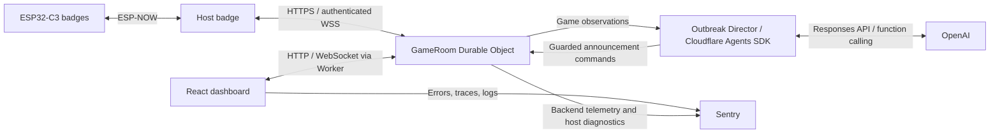

# Trojan Badge

A zombie apocalypse tag game played on ESP32-C3 badges, with a live web dashboard
and an AI Outbreak Director. Players register on their badges, receive a human
or zombie role, and try to survive or spread the infection before time runs out.
The badges handle nearby radio interactions; Cloudflare maintains the shared
game state and connects the physical game to the dashboard.

## How it works

1. Players press A to register their badges through a designated host badge.
2. The operator starts a round from the host or dashboard. The backend waits for
   every registered badge to acknowledge preparation, assigns Patient Zero, and
   schedules a shared five-second countdown.
3. Badges exchange tag messages over ESP-NOW. The host relays infection evidence
   to the backend, which validates it and publishes canonical roles and results.
4. The dashboard receives live population updates over WebSockets. The Outbreak
   Director observes meaningful game changes and can send announcements, schedule
   follow-ups, and publish a recap backed by recorded events.

## Cloudflare backend

Cloudflare Workers serve the React/Vite dashboard and route API and WebSocket
traffic. Each game has a `GameRoom` Durable Object with SQLite storage for
registrations, round state, infection evidence, decisions, and command delivery.
Dashboard sockets use the Durable Object hibernation API.

The host gateway acknowledges infection evidence after durable storage and
replays outstanding decisions and commands until badges acknowledge application.
This supports reconnects and late synchronization while preserving the evidence
used to decide the round. A provisional result can be shown promptly and finalized
after the remaining badge evidence arrives.

See [backend architecture](backend/README.md) and the
[gateway contract](docs/backend-contract.md).

## Firmware and radio recovery

The badge firmware is written in C with ESP-IDF and FreeRTOS. It drives the
320×240 ST7789 display, buttons, and six WS2812B LEDs, alongside the ESP-NOW radio,
game logic, local storage, and host gateway. Radio messages use authentication
and game/round identity checks; tag handling includes signal-strength checks and
cooldowns.

Recovery work adds bounded radio retries, snapshot and command catch-up for
returning badges, and late reset delivery. An unreachable badge cannot hold up
unrelated gateway commands. Badges share the server's countdown timestamp and
prioritize tag feedback over director announcements. During an active round,
local radio gameplay can continue through an Internet interruption, with cloud
state catching up after connectivity returns.

The fresh-boot policy clears local game history and requires registration again;
pending events that were never uploaded are lost on reboot. LIVEG013 adds a
channel-discovery fix, which makes clients follow the host's
authenticated advertised channel. Its documented build and native checks pass;
physical confirmation is still pending.

See [hardware](docs/hardware.md), [sync recovery](docs/firmware-sync-recovery.md),
[channel discovery](docs/channel-discovery.md), and the [radio protocol](docs/protocol.md).

## Outbreak Director: Cloudflare + OpenAI

The director runs as a Cloudflare Agents SDK agent in its own Durable Object.
Cloudflare stores its observations, action history, recaps, and request budgets.
Its [scheduled follow-ups](https://developers.cloudflare.com/agents/runtime/execution/schedule-tasks/)
persist across agent restarts and run independently of an open dashboard.

The OpenAI Responses API supplies model responses and
[function-call choices](https://developers.openai.com/api/docs/guides/function-calling).
The checked-in configuration uses `gpt-4.1-mini`. The application executes four
tools with server-side validation:

| Tool | Purpose |
| --- | --- |
| `read_game_state` | Read current authoritative state and recent infection evidence. |
| `send_announcement` | Send a short, expiring message through the host to badge displays. |
| `schedule_follow_up` | Revisit the game after a bounded delay. |
| `publish_recap` | Select a headline and supporting event IDs for a server-rendered factual recap. |

Gameplay code retains authority over infection decisions, roles, timing, and
winners. Announcements must pass freshness, expiry, and rate checks. API failures
or exhausted budgets leave local gameplay running. The current configuration
allows at most 60 requests per UTC day, 18 per round, and 600 output tokens per
request; these limits are not a dollar cap.

The dashboard exposes the director's observations, actions, follow-ups, recaps,
and API activity, plus a persistent enable/disable toggle. The OpenAI key remains
a Worker secret. See [director configuration and demo steps](docs/outbreak-director.md).

## Sentry observability

The dashboard uses `@sentry/react`; the Worker and GameRoom use
`@sentry/cloudflare` for error monitoring, distributed tracing, and structured
logs. Trace and action IDs connect browser controls to backend processing and
pushed state updates. Round and boot IDs correlate asynchronous host activity.

Host firmware sends bounded diagnostic snapshots over its existing authenticated
gateway connection. The backend forwards health information such as uptime,
heap, stack minima, reconnects, failures, and drops to Sentry. Diagnostics yield
to pending game work and do not add mesh traffic.

Telemetry filters player names, badge MAC addresses, credentials, and raw payloads.
Production configuration uses 10% trace sampling; Session Replay and Application
Metrics are disabled. Replay support is available as an explicit opt-in with
privacy masking. See [Sentry setup and verification](docs/sentry.md).

## Project layout and release status

| Directory | Contents |
| --- | --- |
| `firmware/` | ESP-IDF application, badge components, and native regression checks. |
| `backend/` | Cloudflare Worker, GameRoom, Outbreak Director, and backend telemetry. |
| `frontend/` | React dashboard, game controls, director panel, and browser telemetry. |
| `tools/` | Guarded badge provisioning, release, flashing, and recovery tools. |
| `docs/` | Protocols, setup, operations, and verification records. |

LIVEG012 integrates firmware sync recovery, the director, and Sentry. The
[integrated release guide](docs/integrated-release.md) records automated validation
and deployment configuration. End-to-end OpenAI activity, physical announcement
delivery, and host diagnostics should be demonstrated with the updated fleet;
automated checks alone do not establish those hardware results.

For setup and operation, start with the release guide and
[live backend notes](docs/live-backend.md). Firmware installation uses the guarded
`tools/badge_ops.py` workflow to preserve the stock bootloader, partition table,
and recovery data.
